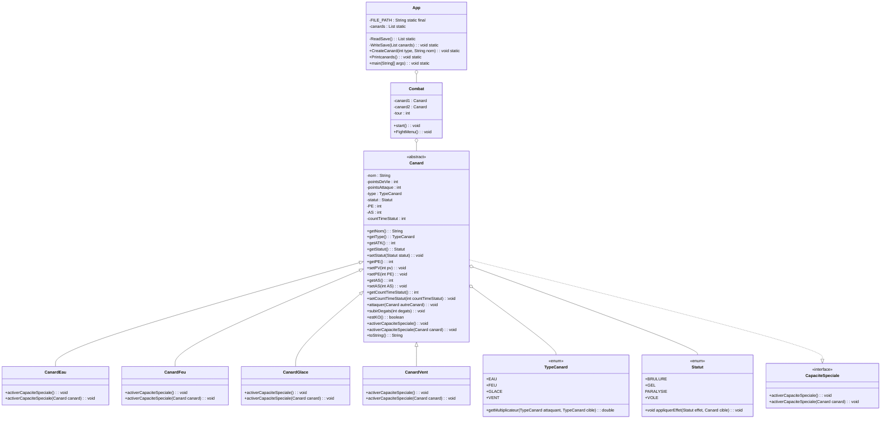

# Diagramme UML

Diagramme de classes UML:

## Explication Diagramme
- `App` est la classe principale qui contient la méthode `main` pour démarrer le programme.

- `Combat` est une classe qui gère le combat entre deux canards (boucle de jeu).

- `Canard` est une classe abstraite qui définit les propriétés et méthodes communes à tous les canards.

- `CanardEau`, `CanardFeu`, `CanardGlace` et `CanardVent` sont des sous-classes de `Canard` qui implémentent les capacités spéciales pour chaque type de canard.

- `TypeCanard` est une énumération qui définit les différents types de canards et fournit une méthode pour obtenir le multiplicateur de dégâts entre deux types de canards.	

- `CapaciteSpeciale` est une interface qui définit la méthode `activerCapaciteSpeciale` pour les capacités spéciales des canards.	

- `Statut` est une enumération qui définit les différents statuts (brûlé, gelé, paralysé, volé) et une méthode pour appliquer l’effet d’un statut sur un canard.

## Explication et Réponses aux questions

### 1. Classes abstraites
- `Canard` pourrait être abstraite, car elle définit les propriétés et comportements communs aux différents canards.

### 2. Interfaces
- `CapaciteSpeciale` pour gérer les capacités spéciales.

### 3. Gestion des statuts (brûlé, paralysé...)
- Une énumération `Statut` pour définir les différents statuts.
- Chaque canard a une liste de statuts actifs, mise à jour à chaque tour.

### 4. Avantages des classes/interfaces supplémentaires
- Facilite l’ajout de nouvelles capacités sans modifier les classes existantes.

### 5. Défis d’extensibilité
- Gestion des interactions entre types de plus en plus complexes.
- Le code devient de plus en plus complexe.
- Si on souhaite créer un vrai jeu équilibré, il faut faire attention à la gestion des types et des capacités spéciales.